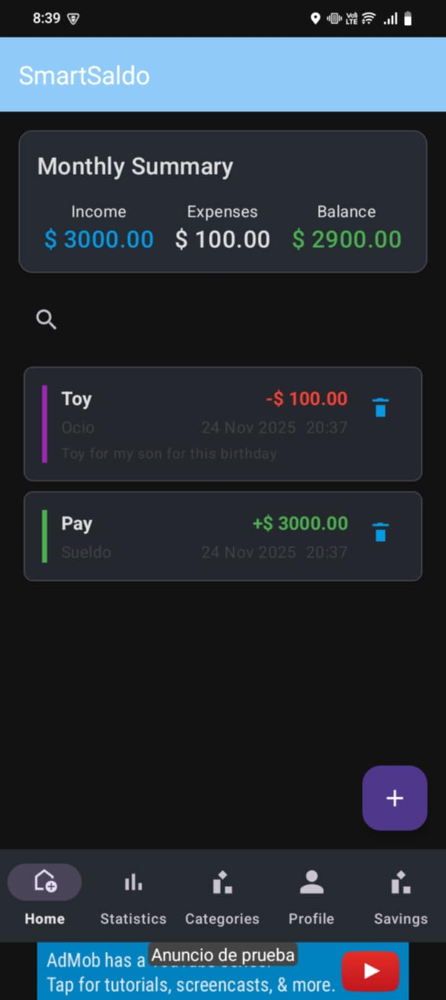
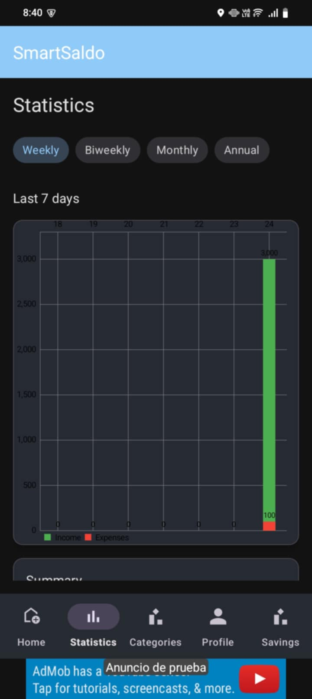
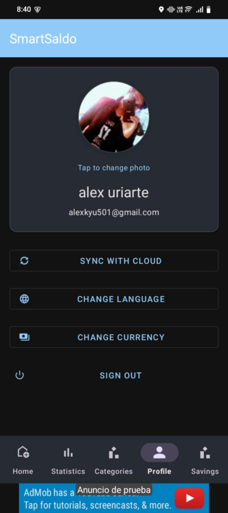
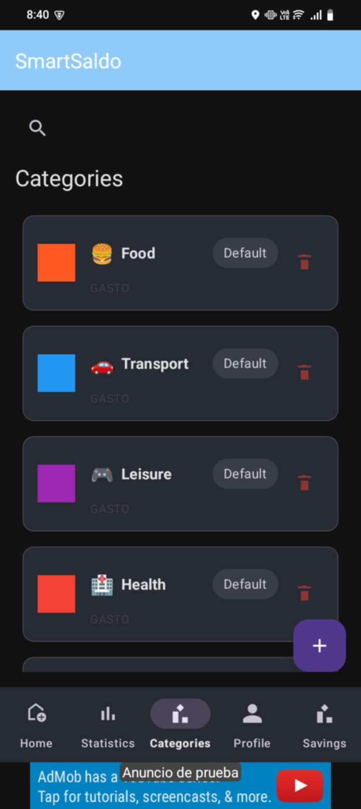
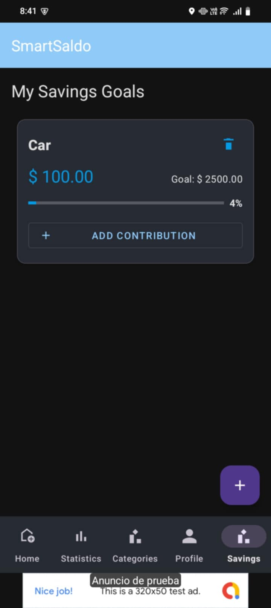
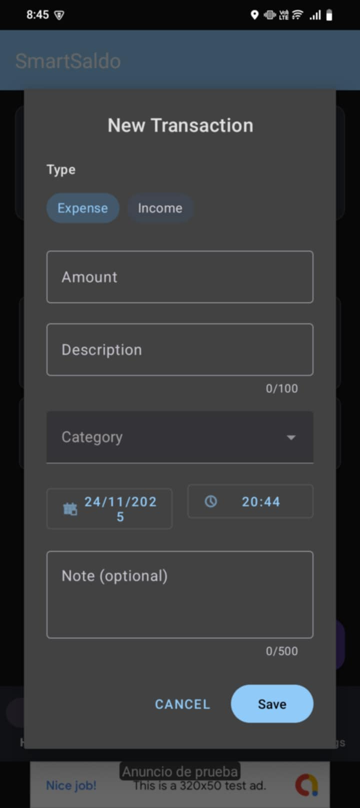

# SmartSaldo – Expense Tracker App 💸📱

SmartSaldo is an Android application to manage personal finances, built as a portfolio project to demonstrate mobile development skills with **Kotlin**, **MVVM**, **Room**, **Firebase** and **multilingual support**.

The app allows users to track **expenses and income**, manage **categories**, view **statistics**, and customize their **profile and language**.

---

## ✨ Main Features

### 👤 Authentication & User Profile
- Email/password authentication using **Firebase Auth**.
- Persistent login session.
- Profile screen with:
  - Display name & email.
  - Profile picture upload (via **Firebase Storage**).
  - Manual data sync button.
  - Logout with confirmation dialog.

### 💸 Transactions (Expenses & Income)
- Create, edit, and delete transactions.
- Each transaction includes:
  - Title / description
  - Amount
  - Date
  - Category
  - Type: **Expense** or **Income**
- Local persistence using **Room**.
- Data associated per user (by user ID).

### 🗂️ Categories
- Default categories for expenses and income.
- User can **add**, **edit**, and **delete** custom categories.
- Each category includes:
  - Name
  - Icon
  - Color
  - Type: Expense / Income
- Categories are linked to transactions.

### 📊 Statistics
- Summary of total **expenses vs income**.
- Balance overview.
- Grouped information by:
  - Category
  - Type
- Basic visual feedback to understand spending patterns.

### 🌍 Localization (Multi-language)
- Full support for:
  - 🇪🇸 **Spanish**
  - 🇺🇸 **English**
- App texts are fully localized via `strings.xml`.
- Categories are translated correctly when changing language.

### 🔄 Sync
- Manual sync button in profile screen.
- Local data is always available thanks to **Room** (offline-first approach).
- Firebase is used mainly for auth and profile pictures.

---

## 🧠 Architecture & Tech Stack

- **Language:** Kotlin
- **Architecture:** MVVM (ViewModel + LiveData/Flow)
- **Local Database:** Room
- **Remote Services:**
  - Firebase Authentication
  - Firebase Storage
- **UI:**
  - XML Layouts
  - Fragments & Activities
  - Material Components
- **Other:**
  - Coroutines & `lifecycleScope`
  - Glide (for image loading)
  - View Binding

The project is structured to keep a clear separation between UI and data layers and to be easy to extend in the future.

---

## 🧱 Project Structure

```text
app/src/main/java/com/smartsaldo/app
│
├── SmartSaldoApplication.kt        # Application class (global initialization)
│
├── ads/                            # Ads integration (AdMob / interstitials)
│   └── AdManager.kt
│
├── data/
│   ├── local/                      # Room database layer
│   │   ├── AppDatabase.kt
│   │   ├── Converters.kt
│   │   ├── dao/
│   │   │   ├── AhorroDao.kt
│   │   │   ├── CategoriaDao.kt
│   │   │   ├── TransaccionDao.kt
│   │   │   └── UsuarioDao.kt
│   │   └── entities/
│   │       ├── Ahorro.kt
│   │       ├── AporteAhorro.kt
│   │       ├── Categoria.kt
│   │       ├── Finanzas.kt
│   │       ├── Movimiento.kt
│   │       ├── TipoTransaccion.kt
│   │       ├── Transaccion.kt
│   │       └── Usuario.kt
│   │
│   └── repository/                 # Repositories (Room + Firebase)
│       ├── AhorroRepository.kt
│       ├── AuthRepository.kt
│       ├── CategoriaRepository.kt
│       └── TransaccionRepository.kt
│
├── di/
│   └── DatabaseModule.kt           # Hilt module for Room
│
├── ui/
│   ├── ahorros/                    # Savings (goals, contributions)
│   │   ├── AddAhorroDialog.kt
│   │   ├── AddAporteDialog.kt
│   │   ├── AhorroAdapter.kt
│   │   ├── AhorrosFragment.kt
│   │   └── AhorroViewModel.kt
│   │
│   ├── auth/                       # Authentication (email / Google)
│   │   ├── LoginActivity.kt
│   │   ├── LoginFragment.kt
│   │   └── RegisterFragment.kt
│   │
│   ├── categorias/                 # Category management
│   │   ├── CategoriaAdapter.kt
│   │   ├── CategoriasFragment.kt
│   │   └── CategoriaViewModel.kt
│   │
│   ├── estadisticas/               # Stats & charts (MPAndroidChart)
│   │   └── EstadisticasFragment.kt
│   │
│   ├── home/                       # Home: list & CRUD of transactions
│   │   ├── AddTransaccionDialog.kt
│   │   ├── EditTransaccionDialog.kt
│   │   ├── HomeFragment.kt
│   │   ├── TransaccionAdapter.kt
│   │   └── TransaccionViewModel.kt
│   │
│   ├── main/                       # Main navigation & splash
│   │   ├── MainActivity.kt
│   │   └── SplashActivity.kt
│   │
│   ├── profile/                    # User profile & sync
│   │   └── ProfileFragment.kt
│   │
│   ├── shared/                     # Shared Auth ViewModel & state
│   │   ├── AuthState.kt
│   │   └── AuthViewModel.kt
│   │
│   └── welcome/                    # Initial setup (language & currency)
│       └── WelcomeSetupActivity.kt
│
└── utils/                          # Helpers & utilities
    ├── CategoriaHelper.kt
    ├── Constants.kt
    ├── CurrencyHelper.kt
    ├── CurrencyUtils.kt
    ├── DateUtils.kt
    ├── LocaleHelper.kt
    ├── NetworkUtils.kt
    └── ValidationUtils.kt


```

## 🚀 How to Run the Project

1. **Clone the repository**

   ```bash
   git clone https://github.com/UriarteDev/AppGastos.git
   cd AppGastos
   ```

2. **Open in Android Studio**

   - Open Android Studio (Giraffe or newer recommended).
   - Click **“Open an existing project”**.
   - Select the project folder.

3. **Configure Firebase**

   - Create a Firebase project.
   - Enable **Email/Password Authentication**.
   - Enable **Firebase Storage** and configure rules (for development):

     ```js
     rules_version = '2';
     service firebase.storage {
       match /b/{bucket}/o {
         match /{allPaths=**} {
           allow read, write: if request.auth != null;
         }
       }
     }
     ```

   - Download `google-services.json` from Firebase console.
   - Place it in: `app/google-services.json`.

4. **Sync Gradle & Run**

   - Click on **Sync Project with Gradle Files**.
   - Choose a virtual or physical device.
   - Run the app.

---

## 📸 Screenshots

A glimpse of the main screens of the app:

### 🏠 Home
Shows the user’s current balance, recent transactions and quick actions.



---

### 📊 Statistics
Visual summary of income and expenses over time (daily, monthly, yearly).



---

### 👤 Profile
User profile, language switching, currency selection and sync options.



---

### 🗂️ Categories
List of income and expense categories with support for search, add, edit, and delete.



---

### 💰 Saving
Savings goals management with progress tracking and contributions.



---

### ➕ Add Transaction
Form to add new income/expense with category, date, description, and amount.




---

## 🧪 Possible Improvements (Future Work)

- Add charts with more detailed analytics.
- Dark mode support.
- Export data to CSV / PDF.
- Add filters by date range (week, month, custom).
- Notifications for reminders (e.g. recurring payments).

---

## 🎯 Why this project is in my portfolio

This project showcases:

- Real-world use of **Firebase** (Auth + Storage).
- **Local persistence** and offline-first thinking with Room.
- **Clean architecture mindset** with separation of concerns.
- **Multilingual app** using Android localization tools.
- Care for **UX details**, such as:
  - Profile management
  - Data sync
  - Error handling and feedback with Snackbars and dialogs

It reflects how I would approach a real mobile product: structured, maintainable, and ready to grow.

---

## 👨‍💻 Author

**Joe Uriarte**  
Android & Mobile Developer

- GitHub: [@UriarteDev](https://github.com/UriarteDev)
- LinkedIn: https://www.linkedin.com/in/uriartedev/
